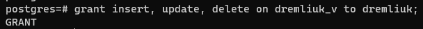
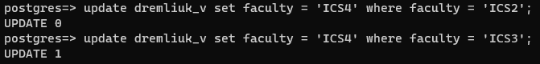

#### 2.2 Вибіркове керування санкціонованим доступом до даних з горизонтальним обмеженням доступу

1. Заповніть таблицю БД ще трьома рядками.

2. Створіть схему даних користувача, назва якої співпадає з назвою користувача, та створіть віртуальну таблицю у цій схемі з правилами вибіркового керування доступом для користувача так, щоб він міг побачити тільки деякі з рядків таблиці з урахуванням одного значення її останнього стовпчика.

3. Встановіть з’єднання з СКБД від імені нового користувача
4. Перевірте роботу механізму вибіркового керування, виконавши операцію SELECT до віртуальної таблиці.

5. Створіть INSERT/UPDATE/DELETE-правила обробки операцій редагування віртуальної таблиці.

6. Перевірте роботу механізму вибіркового керування, виконавши операції INSERT, UPDATE, DELETE до віртуальної таблиці.

Команда вставки виконується не залежно від правил керування доступом

Команда оновлення виконується у відповідності з правилами керування доступом

Команда видалення тиакож виконується у відповідності з правилами керування доступом