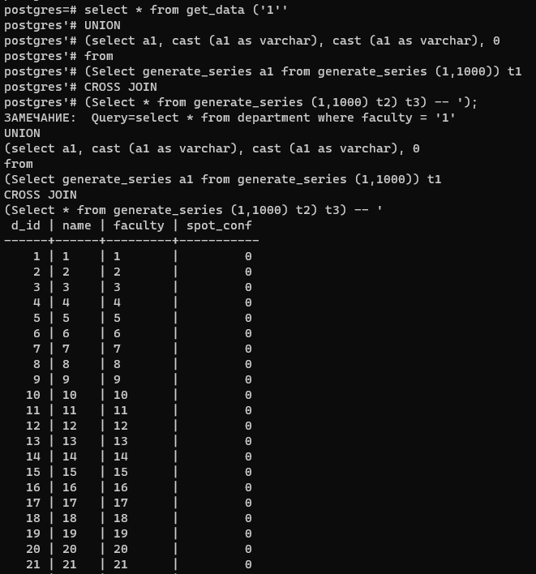
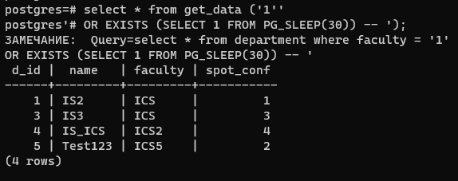

#### Виклики функції з SQL-ін'єкціями по порушенню доступності

Приклад SQL-ін'єкції підкласу "Включення додаткового запиту з декартовим перемноженням підвищеним навантаженням на сервер":

SQL-ін'єкції підкласу "Включення підзапиту зі сплячим процесом":

