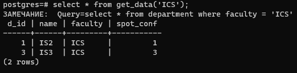
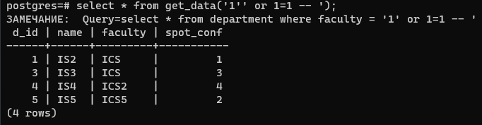
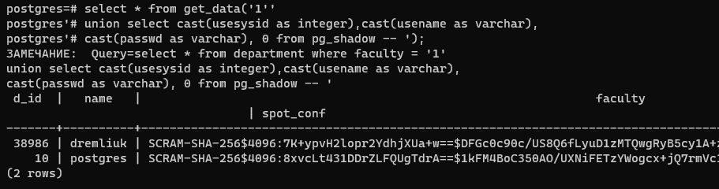
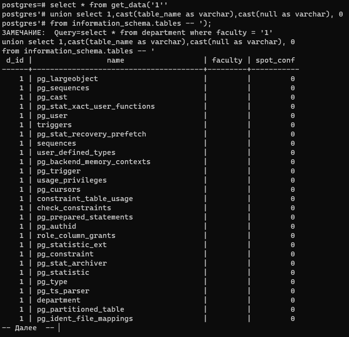

#### Виклики функції з SQL-ін'єкціями по порушенню конфіденційності даних

Стандартний параметр:

Приклад SQL-ін'єкції підкласу "Зняття фільтрації рідків умови SQL-запиту":

SQL-ін'єкції підкласу "Отримання вмісту таблиць, що не входять у SQL-запит":

SQL-ін'єкції підкласу "Отримання структури таблиць БД":

