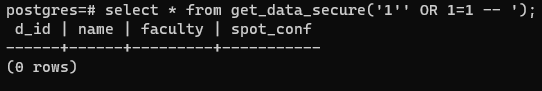
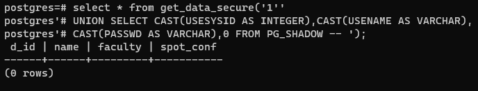
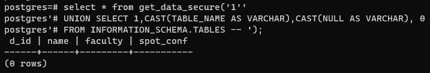
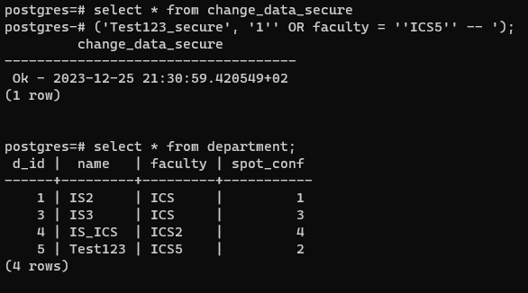
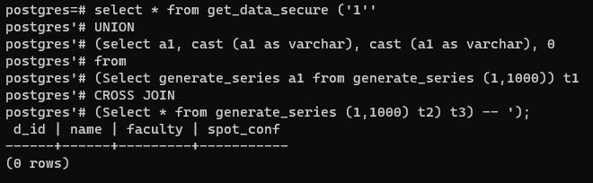
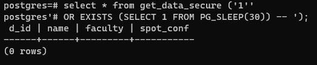

#### Виклики безпечних функцій з SQL-ін'єкціями по порушенню конфіденційності даних

#### Виклики безпечних функцій з SQL-ін'єкціями по порушенню цілісності даних

#### Виклики безпечних функцій з SQL-ін'єкціями по порушенню доступності

Як можна побачити, жодна атака з використанням SQL-ін'єкцій не спрацювала