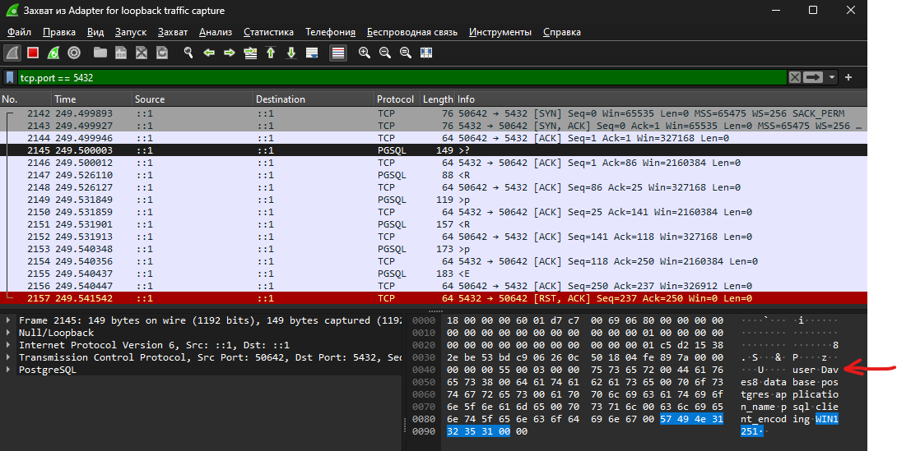

10. Проаналізувати вміст перехоплених пакетів та збережених раніше у файлі, наприклад, res.dump. Підтвердити передачу деяких даних у відкритому вигляді.

В одному з пакетів можна побачити логін та назву бази даних