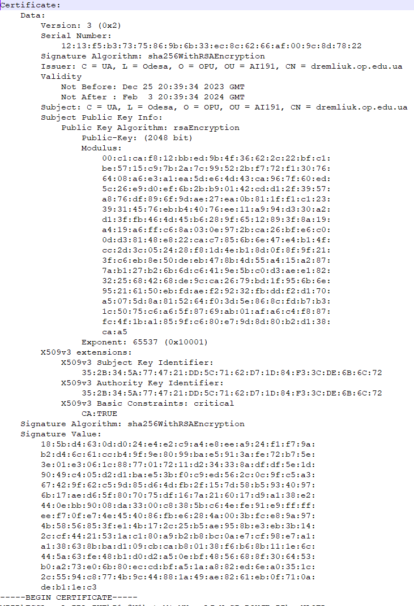

3. Переглянути вміст сертифікату та визначити алгоритми створення відкритого ключа, а також алгоритм встановлення цифрового підпису.

Алгоритм створення відкритого ключа - rsaEncryption; алгоритм створення цифрового підпису - sha256WithRSAEncryption