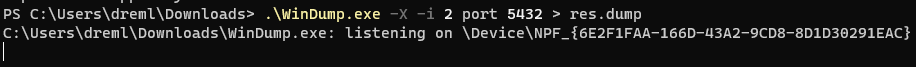
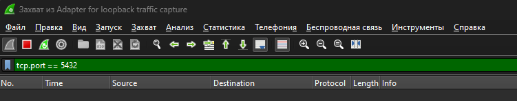

8. Запустити програму аналізу мережевих пакетів в режимі прослуховування обраного мережевого інтерфейсу та налаштувати її на перегляд пакетів, які пов`язані з портом 5432 (порт прослуховування запитів СКБД PostgreSQL), зберігаючи зміст пакетів в окремому файлі через перенаправлення потоку, наприклад, > res.dump. Результати роботи будуть використанні у наступних завданнях.

У Wireshark:

